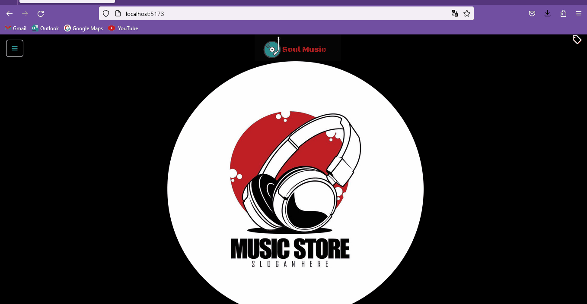

# Segunda Pre-Entrega React JS
### Arian Canteros Sanz

##### El proyecto se basa en un **e-commerce** en el cual vamos desarrollando distintas técnicas segun avanza la cursada. Para no complicar demasiado simulo una página de guitarras y las filtramos por formato de sonido:
1. Eléctricas
1. Acústicas

#### Mediante distintos componentes tambien podemos calcular las unidades vendidas dependiendo del stock disponible hasta el momento. Les dejo un breve GIF del mismo:

### **SALUDOS!**